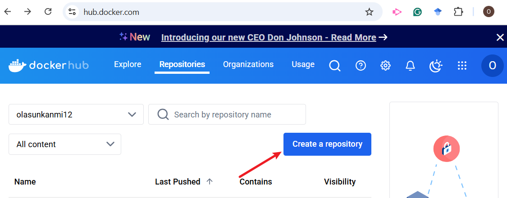
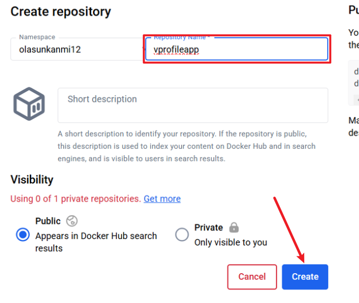
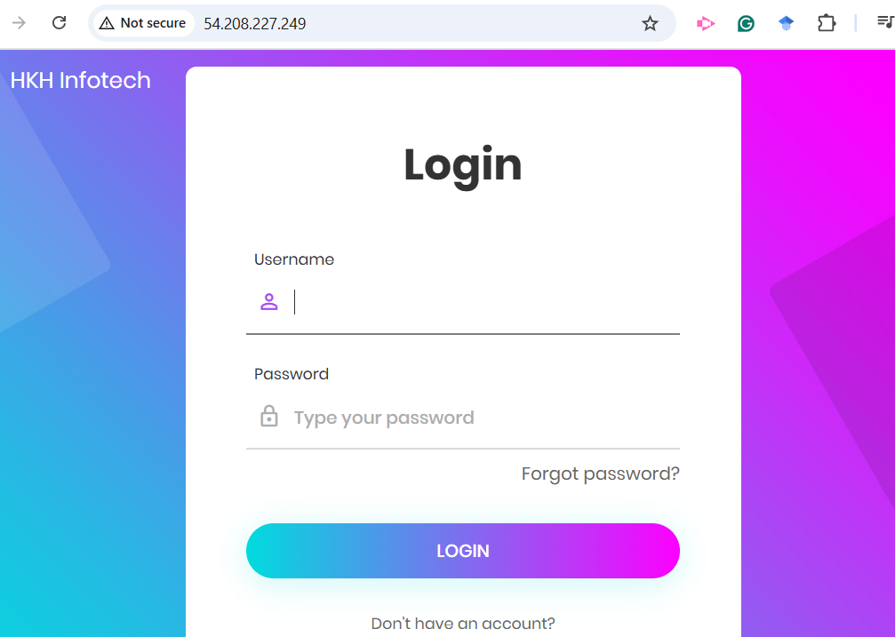
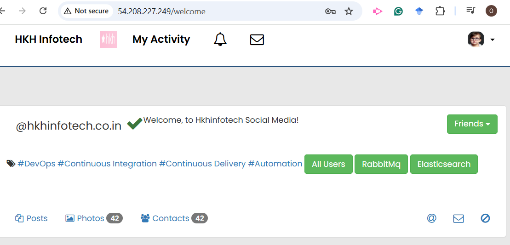

# Java Application Dockerized
## Overview
This project is a Java-based application, forked from my mentor's GitHub repository. The application comprises five distinct services and follows a structured deployment process. The application artifact is first built using Maven and subsequently deployed to a Tomcat server for execution.

For containerization, the same approach is followed using a multi-stage Docker build. In the first stage, the application artifact is compiled using Maven within a dedicated build environment. In the final stage, the compiled artifact is copied into a lightweight Tomcat-based runtime environment, ensuring an optimized and efficient deployment.

This multi-stage build process enhances security, reduces the final image size, and improves overall performance by separating the build dependencies from the runtime environment.

### Services Included
The application consists of the following services:
- Tomcat – Java servlet container
- Nginx – Web server and reverse proxy
- RabbitMQ – Message broker
- Memcached – Caching system
- MySQL – Relational database

### Prerequisites

To run this project, you need:

- A server or machine with Docker installed 
- A text editor (e.g., VS Code, Vim, Nano) to write and modify Dockerfiles.
- Docker hub account

### Getting Started
1. Sign-up/sign-in to docker hub [here](https://hub.docker.com/) 

2. Create repositories for the images that will be built.
The three repositories are: vprofileapp, vprofiledb, vprofileweb. 

3. If using AWS cloud for your server, then;
    - setup your infrastructure, you can use this terraform [link](https://github.com/Olasunkanmi-O/terraform-lab)
    - install docker engine on the server → [Install Docker](https://docs.docker.com/engine/install/)
    - add the user (ubuntu or ec2-user) to the docker group, log out and re-login to reload the user profile
    
    - create the folder structure as depicted in the Docker-files directory.
    - using your preferred text editor, write the dockerfiles
4. Write the Dockerfiles based on the needs of the application as described [here](./ContainerizationServiceList.txt)
    - App Dockerfile: this is a multistage build process which include the build stage and the runtime stage
    - DB Dockerfile: since the database is written in MYSQL, we use MySQL base and inject the schema into the image
    - Web Dockerfile: remove the default conf file and replace with this new one that just sets reverse proxy for the application.
    - Memcache and rabbitmq do not need different images as there are no configurations for them, so we will use the base images
5. Write the Docker compose file using the information in the application.properties file specifying the image names, container names, volumes and ports as required
    - vproapp: volume will be matched to /usr/local/tomcat/webapps in line with the default directory of tomcat application
    - vprodb: opened on port 3306, the volume will be on /var/lib/mysql and an environment set for the root password for MySQL
    - keep port 11211 open for memcache and 5672 for rabbitMQ, equally maintain default username and password for rabbitMQ 
6. Back to the terminal, navigate to where you have the Docker-files and the compose file - ensure they are together, run the command `docker compose build`
 
7. When the build is completed, check that the images are built using this command `docker images`

8. After verifying the images are created, then we can run the containers using the compose file again via this command `docker compose up -d`

9. Get the ip address of your server ( port 80 should be opened to allow HTTP), paste same on your browser and view the running application, below image shows the nginx has sent the request to tomcat server and you can access the app.

10. use username and password as vp_admin to access the app. 
11. Once you login, that confirms the database connectivity

12. Initiate RabbitMQ 

13. Click on All Users and click on any number to get below responses

14. click on back and click the same user again and confirm that the new response is coming from the cached data 

15. Now that we have confirmed the containers are running well, then we can push our images to docker hub using this command, `docker login` to login to docker hub and `docker push` followed by your account name/the image name

### clean up
1. navigate to the directory where you have the compose.yaml file, execute this command `docker compose down`

2. Run `docker volume ls ` to see the list of volumes created, then use `docker volume rm` with the volume name to remove them

3. To remove any unused volume `docker volume prune`
4. You can also use `docker system prune -a` for complete system cleanup, read the warning and be sure this is what you intend to do before proceeding.

